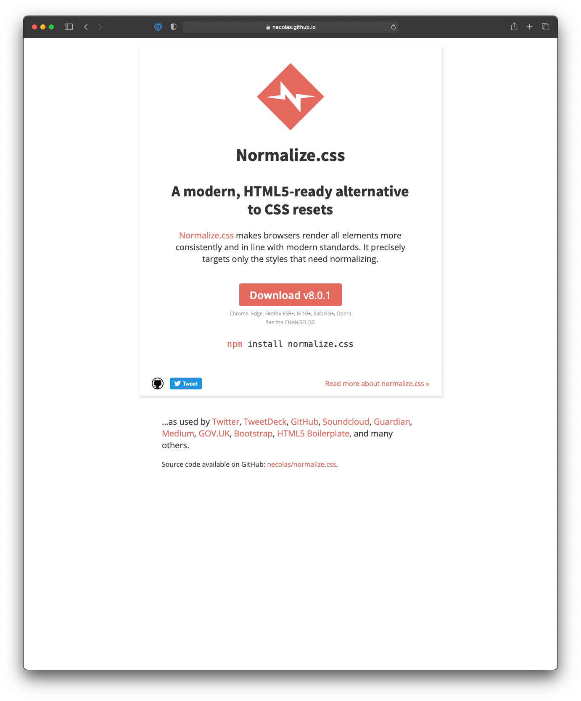
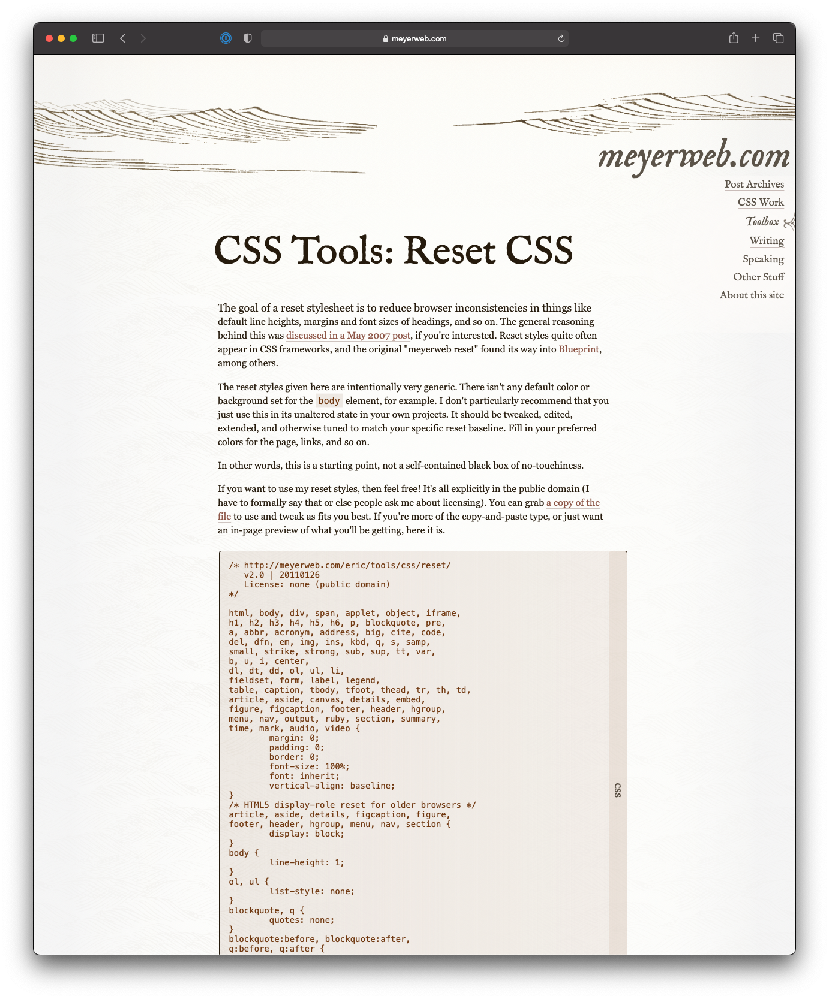

build-lists: true
footer: IDM 221: Web Authoring I
slidenumbers: true
autoscale: true
theme: Cobalt2, 1

# IDM 221

## Web Design I

### CSS Default Styles

---

# Objectives

- Discuss Default Browser Styles
- Introduce Normalize Technique
- Introduce Reset Technique
- Introduce CSS Remedy

---

# Objective

## Discuss Default Browser Styles

---

## Browser Default Styles

^ A problem web developers face today when it comes to CSS is that the five modern browsers render some elements of a web page differently. Let's look at some examples.

---

---

---

---

# Objective

## Introduce Normalize Technique

---

## CSS Normalize

- [CSS Normalize](http://necolas.github.io/normalize.css)
- [github.com/normalize](https://github.com/necolas/normalize.css/)

^ To standardize how elements like this are displayed, you can use the _normalize.css_ style sheet. This can save you a lot of time dealing with small rendering issues near the end of a project.

^ The normalize style sheet also sets the margins for the body of the document to zero. That means there's no space between the body and the edge of the browser window. This is important because different browsers provide different margins for the body. It also defaults the font family to sans-serif, which we'll learn more about later. For reasons like these, many web developers use the normalize style sheet for all their projects.

^ Save a copy of the normalize.css file to your website and then code a link to the file in the `head` of each html page. Note: this link should be before the link to your personal style sheet(s).

---

# Objective

## Introduce Reset Technique

---

## CSS Reset

- [CSS Reset](https://meyerweb.com/eric/tools/css/reset/reset.css)

---

# Objective

## Introduce CSS Remedy

---

## CSS Remedy

- [CSS Remedy](https://github.com/jensimmons/cssremedy)
