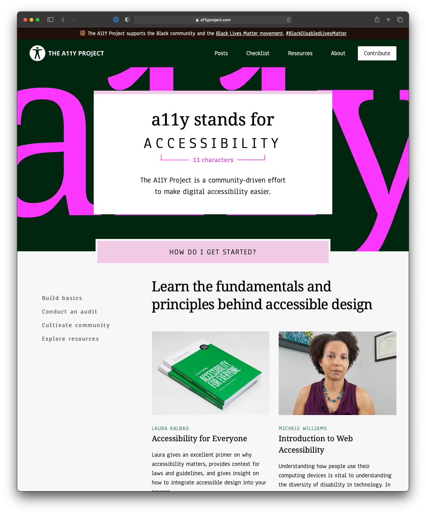
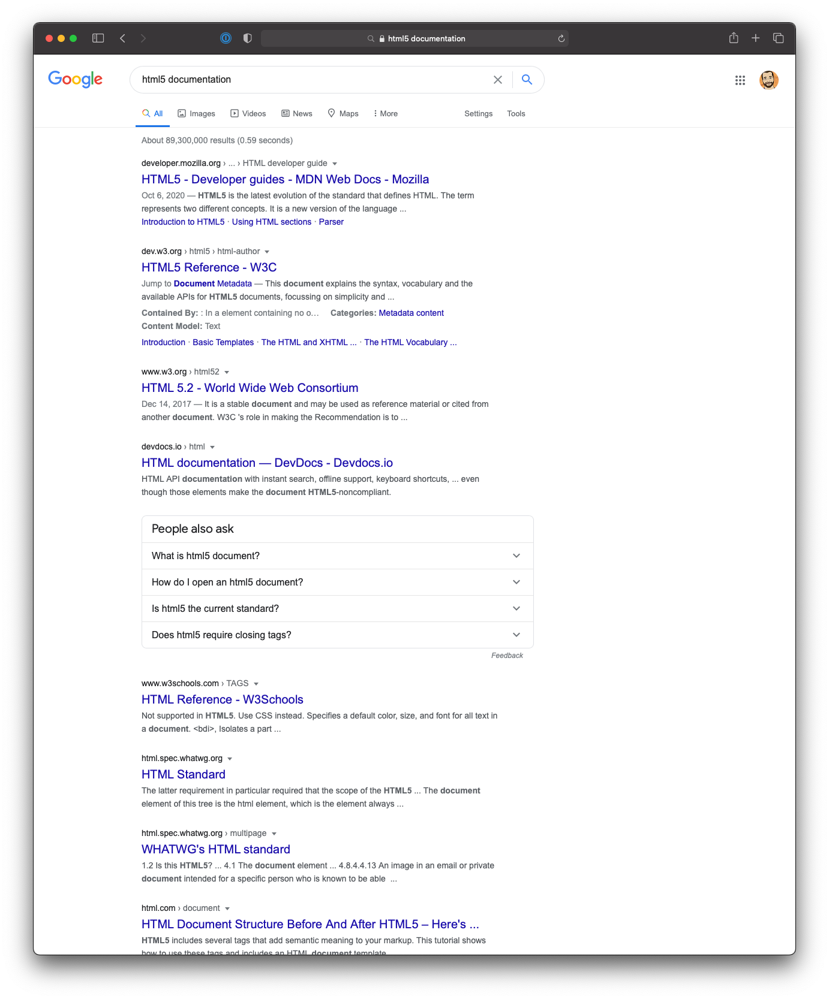
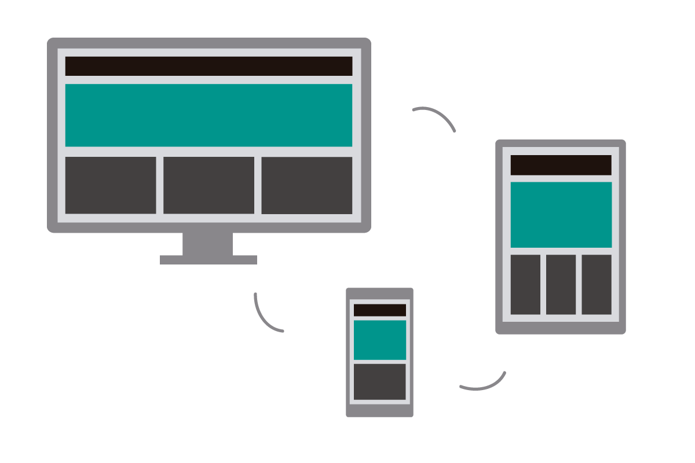
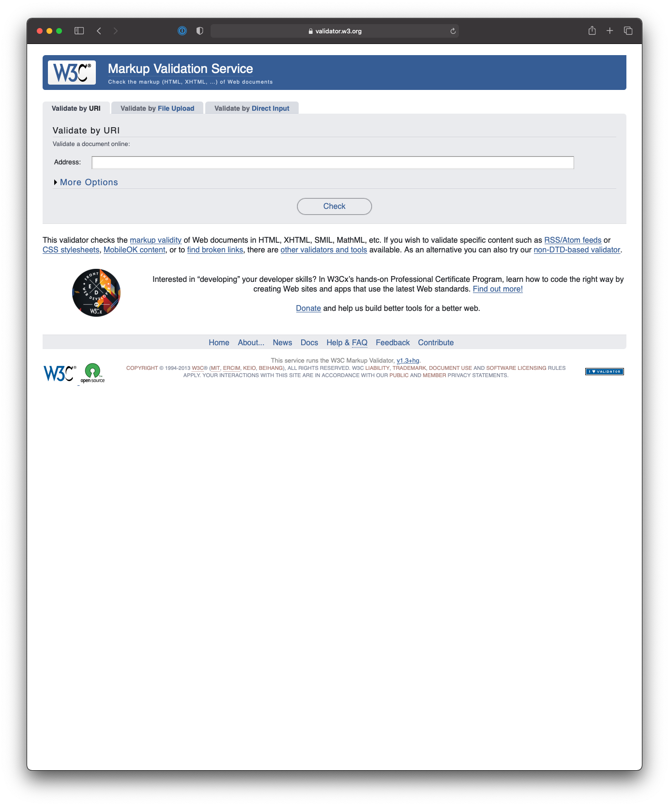

build-lists: true
footer: IDM 221: Web Authoring I
slidenumbers: true
autoscale: true
theme: Cobalt2, 1

# IDM 221

## Web Design I

### Basic HTML Text

---

# Objectives

- Review Critical Web Development Concepts
- Introduce Basic HTML Concepts
- Introduce the Text Editor

---

# Objective

## Review Critical Web Development Concepts

---

# Critical Concepts

- Users/Usability
- Cross browser compatibility
- User accessibility
- Search engine optimization (SEO)
- Responsive web design (RWD)

^ There are some critical concepts we need to be familiar with before we begin a project. Without considering these concepts, you're project will probably lack components that make it stand out as a well functioning, enjoyable experience.

---

## Users and Usability


^ Before you design a website, you need to think about who your users are going to be and what they are going to expect. Remember, users determine the success of a website. What do users want when the reach a website? **The want to find what they're looking for as quickly and easily as possible**. When they find it, they want to extract the information or do the task as quickly and easily as possible.

^ How do users use a page? They don't read it in an orderly fashion, and they don't like to scroll any more than they have to. If they can't find what they're looking for or get frustrated, they leave the site. In web development terms, what users want is _usability_. The term refers to how easy it is to use a website. If a site is easy to use, it has a chance to be effective. 1. present critical content above the fold 2. group related items and limit the number of groups 3. include a header that identifies the site and provides navigation 4. use current navigation conventions (e.g. logo goes to home page)

---

## Cross Browser Compatibility


- Use supported HTML5 and CSS3 features
- Test all pages on all major browsers
- [Can I Use?](http://caniuse.com)
- [HTML 5 Test](http://html5test.com)

^ If you want your website to be used by as many visitors as possible, you need to make sure that your web pages are compatible with as many browsers as possible. That's known as _cross browser compatibility_. Modern browsers also include special _Developer Tools_ that include Emulation options that will help us test our code.

^ Let's go over a few basic guidelines. (_click_) Make sure to use supported HTML5 and CSS3 features when coding your site, (_click_) test all pages on all major browsers, not just your favorite browser. Before using a feature or tag, (_click_) check it's current availability on all modern browsers.

---

## Accessibility



^ _Accessibility_ refers to the qualities that make a website accessible to as many users as possible, especially disabled users. Visually impaired users may not be able to read text that's in images, so you need to provide other alternatives for them. Users with motor disabilities may not be able to use a mouse, so you need to make sure that all of the content and features can be accessed through the keyboard.

^ There are many information sources on accessibility, we'll review the guidelines for coding the elements and attributes that provide accessibility as we progress through the course.

---

## Search Engine Optimization



^ SEO refers to the goal of optimizing your website so your pages rank higher in search engines like Google, Bing and Yahoo. Although the search algorithms that are used by search engines change frequently, there are some common coding techniques that will help your pages do better in the search engines. We'll review these guidelines as we build our pages.

---

## Responsive Web Design



^ The term _Responsive web design_ refers to the theory and practice of creating websites that adapt gracefully to all viewing mediums, from desktop computers to mobile phones. The layout of a website adapts to the viewing environment by using fluid, proportion-based grids, flexible images, and CSS3 media queries.

---

# Objective

## Introduce Basic HTML Concepts

---

```html
<!DOCTYPE html>
<html lang="en">
<head>
  <meta charset="UTF-8">
  <title>My Document Title</title>
</head>
<body>
  <h1>Welcome to my page.</h1>
  
  <p>
    Lorem ipsum dolor sit amet, consectetur adipisicing elit,
    sed do eiusmod tempor incididunt ut labore et dolore magna aliqua.
    Ut enim ad minim veniam, quis nostrud exercitation ullamco laboris
    nisi ut aliquip ex ea commodo consequat. Duis aute irure dolor in
    reprehenderit in voluptate velit esse cillum dolore eu fugiat
    nulla pariatur. Excepteur sint occaecat cupidatat non proident,
    sunt in culpa qui officia deserunt mollit anim id est laborum.
  </p>
</body>
</html>
```

^ An HTML document contains HTML elements that define the content and structure of a web page. Each HTML document consists of two parts: the DOCTYPE declaration and the document tree.

---

```html, [.highlight: 1]
<!DOCTYPE html>
<html lang="en">
<head>
  <meta charset="UTF-8">
  <title>My Document Title</title>
</head>
<body>
  <h1>Welcome to my page.</h1>
  
  <p>
    Lorem ipsum dolor sit amet, consectetur adipisicing elit,
    sed do eiusmod tempor incididunt ut labore et dolore magna aliqua.
    Ut enim ad minim veniam, quis nostrud exercitation ullamco laboris
    nisi ut aliquip ex ea commodo consequat. Duis aute irure dolor in
    reprehenderit in voluptate velit esse cillum dolore eu fugiat
    nulla pariatur. Excepteur sint occaecat cupidatat non proident,
    sunt in culpa qui officia deserunt mollit anim id est laborum.
  </p>
</body>
</html>
```

^ The DOCTYPE declaration shown here indicates that the document is going to use HTML5. You need this at the start of every HTML document.

---

```html, [.highlight: 2, 20]
<!DOCTYPE html>
<html lang="en">
<head>
  <meta charset="UTF-8">
  <title>My Document Title</title>
</head>
<body>
  <h1>Welcome to my page.</h1>
  
  <p>
    Lorem ipsum dolor sit amet, consectetur adipisicing elit,
    sed do eiusmod tempor incididunt ut labore et dolore magna aliqua.
    Ut enim ad minim veniam, quis nostrud exercitation ullamco laboris
    nisi ut aliquip ex ea commodo consequat. Duis aute irure dolor in
    reprehenderit in voluptate velit esse cillum dolore eu fugiat
    nulla pariatur. Excepteur sint occaecat cupidatat non proident,
    sunt in culpa qui officia deserunt mollit anim id est laborum.
  </p>
</body>
</html>
```

^ The _document tree_ starts with the html element, which marks the beginning and end of the HTML code. This element can be referred to as the root element of the document. The `html` element (note the opening and closing tags) always contains:

---

```html, [.highlight: 3-6]
<!DOCTYPE html>
<html lang="en">
<head>
  <meta charset="UTF-8">
  <title>My Document Title</title>
</head>
<body>
  <h1>Welcome to my page.</h1>
  
  <p>
    Lorem ipsum dolor sit amet, consectetur adipisicing elit,
    sed do eiusmod tempor incididunt ut labore et dolore magna aliqua.
    Ut enim ad minim veniam, quis nostrud exercitation ullamco laboris
    nisi ut aliquip ex ea commodo consequat. Duis aute irure dolor in
    reprehenderit in voluptate velit esse cillum dolore eu fugiat
    nulla pariatur. Excepteur sint occaecat cupidatat non proident,
    sunt in culpa qui officia deserunt mollit anim id est laborum.
  </p>
</body>
</html>
```

^ one `head` element that provides information about the document and

---

```html, [.highlight: 7-19]
<!DOCTYPE html>
<html lang="en">
<head>
  <meta charset="UTF-8">
  <title>My Document Title</title>
</head>
<body>
  <h1>Welcome to my page.</h1>
  
  <p>
    Lorem ipsum dolor sit amet, consectetur adipisicing elit,
    sed do eiusmod tempor incididunt ut labore et dolore magna aliqua.
    Ut enim ad minim veniam, quis nostrud exercitation ullamco laboris
    nisi ut aliquip ex ea commodo consequat. Duis aute irure dolor in
    reprehenderit in voluptate velit esse cillum dolore eu fugiat
    nulla pariatur. Excepteur sint occaecat cupidatat non proident,
    sunt in culpa qui officia deserunt mollit anim id est laborum.
  </p>
</body>
</html>
```

^ one `body` element that provides the structure and content of the document.

---

```html
<!DOCTYPE html>
<html lang="en">
<head>
  <meta charset="UTF-8">
  <title></title>
</head>
<body>

</body>
</html>
```

^ It's a good practice to start every HTML document from a template that contains this code or from another HTML document similar to the one you are going to create.

^ When you use HTML5, you can code elements using lowercase, uppercase, or mixed case. For consistency, you should use lowercase unless uppercase is required. **Best practice**

---

## Opening and closing tags

```html
<h1>Refresh Philly</h1>
<p>Our goal is to bring together the best and
  brightest web professionals in the Philadelphia
  area so that we may learn from one another.</p>
```

^ As you've seen, most HTML elements start with an _opening tag_ and end with a _closing tag_ that is like the opening tag but has a slash within it.

---

## Empty tags

```html
<br />

```

^ Some elements have no content or closing tag. These tags are referred to as _empty tags_.

---

## Nesting

```html
<!-- correct nesting -->
<p>Order your copy <i>today</i></p>

<!-- incorrect nesting -->
<p>Order your copy <i>today</p></i>
```

^ This example shows the right and wrong way to code tags when one element is nested within another. The tags for one element shouldn't overlap with the tags for another element.

---

## Basic Text

```html
<h1>Heading 1</h1>
<h2>Heading 2</h2>
<h3>Heading 3</h3>
<h4>Heading 4</h4>
<h5>Heading 5</h5>
<h6>Heading 6</h6>
<p>Hello there, I am a paragraph.</p>
```

---

## Comments

```html
<!DOCTYPE html>
<!-- This document display the home page -->
```

^ Here is an example of how to code HTML _comments_. One common use of comments is to describe or explain portions of code.

---

## Multi-line Comments

```html
<body>
  <h1>My Home Page</h1>
  <!--
    <ul>
      <li>Eagles</li>
      <li>Flyers</li>
      <li>Phillies</li>
      <li>76ers</li>
    </ul>
  -->
  <p>Contact us...
```

^ Another common use of comments is to comment out a portion of the code. This is useful when you're testing a web page and you want to temporarily disable a portion of code that you're having trouble with.

---

## Whitespace

```html
<html lang="en">
<head>
  <meta charset="UTF-8">
  <title>My Document Title</title>
</head>

<body>
  <h1>Welcome to my page.</h1>
  <p>
    Lorem ipsum dolor sit amet, consectetur adipisicing elit,
    sed do eiusmod tempor incididunt ut labore et dolore magna aliqua.
  </p>
</body>
</html>
```

^ Whitespace is ignored when an HTML document is rendered. You can use the whitespace characters to format your HTML, so it is easier to read. In this example, you can see how whitespace has been used to indent and align the HTML elements. This is considered a **best practice**. Although whitespace doesn't effect the way an HTML document is rendered, it does take up space in the HTML file. As a result, you shouldn't overdo your use of it. Just use enough to make your code easy to ready.

---

## Attributes

```html
<!-- opening tag, one attribute -->
<a href="contact.html">

<!-- opening tag, three attributes -->
<a href="contact.html" title="Click to contact us" class="nav_link">

<!-- empty tag attributes -->

```

^ Attributes are coded within the opening tag of an element or within an empty tag. For each attribute, you code the attribute name, an equals sign, and then the attribute value.

---

## Boolean Attributes

```html
<!-- Boolean attribute -->
<input type="checkbox" name="mailList" checked>
```

^ A Boolean attribute can have just two values, which represent either on or off. To turn a Boolean attribute on, you code the name of the attribute. In this example, The check attribute turns the attribute on, which causes the related checkbox to be checked when it is rendered by the browser. If you want the attribute to be off when the pages remember, you don't go the attribute.

---

## Identifying Elements

```html
<!-- `id` attribute -->
<div id="page">

<!-- `class` attribute -->
<a href="contact.html" class="nav_link">
```

^ We will be able to use certain attributes to help identify and group elements within our documents. This example illustrates the use of two attributes that are commonly used to identify HTML elements. The ID attribute is used to uniquely identify just one element, so each ID attribute must have a unique value. The class attribute can be used to mark one or more elements, so the same value can be used for more than one class attribute.

---

# Objective

## Introduce the Text Editor

---

## Helpful VSCode Extensions

- [HTML Linting](https://marketplace.visualstudio.com/items?itemName=mkaufman.HTMLHint)
- [HTML Hint](https://marketplace.visualstudio.com/items?itemName=mkaufman.HTMLHint)
- [Nest Comments](https://marketplace.visualstudio.com/items?itemName=philsinatra.nested-comments)
- [Encode Decode](https://marketplace.visualstudio.com/items?itemName=mitchdenny.ecdc)

^ Linting is a term used to describe reviewing code for syntactical errors. One of the benefits of using a text editor designed for programming is that there are tools available to help detect mistakes in your code. VSCode has an extension that will detect HTML errors as you work.

---

## HTML Validation

- [W3C markup validation service](https://validator.w3.org)



^ To validate and HTML document, you use a program where website for that purpose. One of the most popular websites for validating HTML is the one for the [W3C markup validation service](https://validator.w3.org). When you use this website, you can provide the HTML document that you want to validate and three ways. You can provide the URL for the page. You can upload the document. And you can copy and paste the document into the Validate by Direct Input tab. Once that's done, you click the Check button to validate the document.
