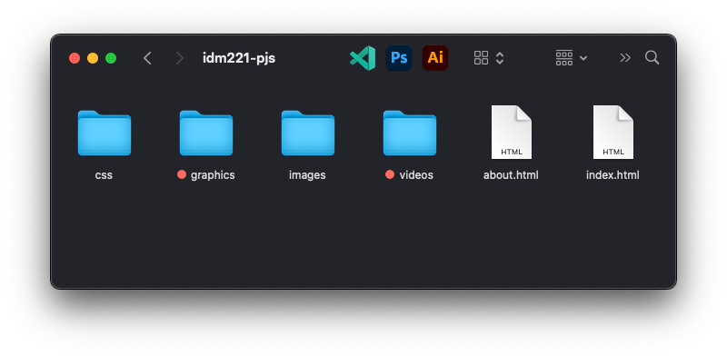

build-lists: true
footer: IDM 221: Web Authoring I
slidenumbers: true
autoscale: true
theme: Cobalt2, 1

# IDM 221

## Web Design I

### Version Control

---

# Objectives

- Introduce Version Control

---

## Version control

^ _Version control_ is a system that records changes to a file or set of files over time so that you can recall specific versions later. If you want to keep every version of a file or project, a Version Control System (VCS) is a very wise thing to use. It allows you to revert files back to a previous state, revert the entire project back to a previous state, compare changes over time, see who last modified something that might be causing a problem, who introduced an issue and when, and more. Using a VCS also generally means that if you screw things up or lose files, you can easily recover. In addition, you get all this for very little overhead.

^ Git is a free and open source distributed version control system designed to handle everything from small to very large projects with speed and efficiency. Git allows groups of people to work on the same documents (often code) at the same time, and without stepping on each other's toes.

---

## Github Desktop Application

- [GitHub Desktop](https://desktop.github.com)

^ There are plenty of apps available that will give you a GUI to work with Git. I'm going to focus on GitHub's native app because I think it's the simplest for getting started quickly.

---

## What Goes In Your Repo (for now)

| Check In ✅ | Do Not Check In ❌ |
| -------- | -------- |
| .html | .psd |
| .css | .ai |
| .js | .mov |
| .md | .mp4 |

^ Since we're just getting started, we're going to keep your repositories as light weight and free of bloat as possible. For this project, we're going to specifically organize your projects so that certain types of files are not included in your repositories.

---

---

## .gitignore

- [Windows](https://github.com/github/gitignore/blob/master/Global/Windows.gitignore)
- [Mac](https://github.com/github/gitignore/blob/master/Global/macOS.gitignore)
- [Linux](https://github.com/github/gitignore/blob/master/Global/Linux.gitignore)

^ You can create a _.gitignore_ file and include it in your repository as a list of files/file types to be specifically ignored when maintaining the repository files. Let's take a look at the .gitignore file for this IDM project.
